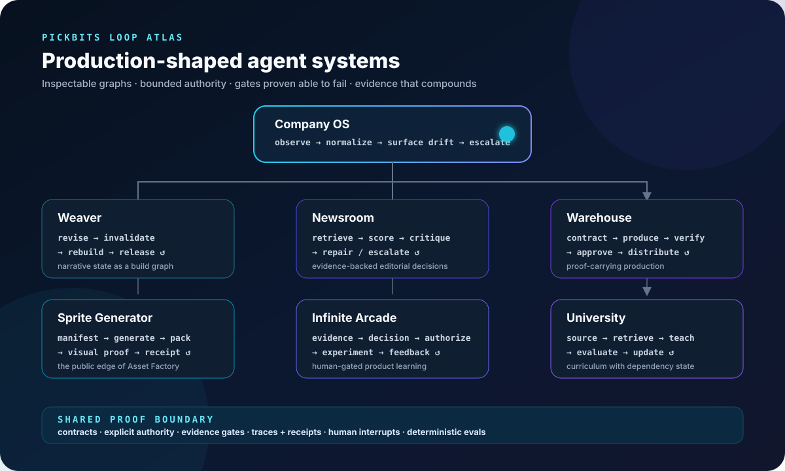

# Agentic systems that prove their work

I’m Mark Pickering, the engineer and systems architect behind [PickBits](https://pickbits.ai/). I build agentic workflows that operate across real products—not chat demos: explicit state graphs, bounded authority, human interrupts, evidence gates, replayable traces, and artifacts the next person or machine can inspect.

**The operating principle:** an agent saying “done” is not evidence.

| If you are here to… | Start here |
| --- | --- |
| inspect the architecture, run the tools, or collaborate on agent infrastructure | **Stay on GitHub.** The systems, loop graphs, evals, and release evidence live here. |
| learn to build and operate with AI, follow the research, or work with me | **[PickBits.ai](https://pickbits.ai/)** — University, field notes, community, and consulting. |
| play the games, join a playtest, or explore the creative worlds | **[PickBits.studio](https://pickbits.studio/)** — the arcade and studio portfolio. |

  

## The public systems

| System | Executable idea | Status |
| --- | --- | --- |
| [Weaver](https://github.com/pickbitsai/weaver) | Revise source truth, invalidate derived narrative state, rebuild, and cut an immutable release through explicit gates. | Public source; clean consumer install proven; registry publication pending |
| [Company OS](https://github.com/pickbitsai/company-os) | Observe many projects, normalize what is really wired and scheduled, and publish a safe operational projection. | Public source; [consumer-release gate in review](https://github.com/pickbitsai/company-os/pull/3); registry publication pending |
| [Sprite Generator](https://github.com/pickbitsai/sprite-generator) | Turn a manifest into generated frames, a validated sheet, and inspectable proof through a human-authorized loop. | [Public extraction in review](https://github.com/pickbitsai/sprite-generator/pull/1); clean install and cross-platform CI proven; registry publication pending |
| [Session Index](https://github.com/MrPickering/session-index) | Recover local Codex and Claude Code sessions without an account, telemetry, or cloud database. | Public |
| [PickBits Dependency Audit](https://github.com/pickbitsai/pickbits-dependency-audit) | Turn dependency risk into persistent evidence and remediation requests without silently granting patch authority. | Public |
| [enView](https://github.com/MrPickering/enView) | Inventory environment-file exposure and drift without printing secret values into audit output. | Public |
| [SimCit](https://github.com/MrPickering/SimCit) | A browser city simulation built from the open Micropolis lineage. | Public · [play](https://sim-cit.vercel.app/) |

Small tools are useful, but the larger goal is a portfolio of **executable loops**: each repository should let a stranger install the system, inspect its graph, replay a sanitized run, and watch its gates accept good work and reject a deliberately bad fixture.

## The extraction map

These systems run inside PickBits today. Their reusable engines are being separated from private data, accounts, brand assets, and operating history before release.

The [open-source readiness scorecard](./docs/open-source-readiness.md) records the repository evidence, the gap for each extraction, and the proof required to cross the line.

| System | Loop being extracted | Public boundary |
| --- | --- | --- |
| **Weaver** | revise → invalidate derived narrative state → rebuild → immutable release | Story-agnostic engine, starter book, provenance, and stale-state tests |
| **Sprite Generator** | manifest → generate → pack/animate → visual verification → receipt | Generator, provider adapters, templates, and verification gates; the Asset Factory remains proprietary |
| **Infinite Arcade** | evidence → editorial/GTM decision → human authorization → experiment → feedback | One honest, currently running decision loop—not unfinished platform claims |
| **Newsroom** | collect → retrieve → score → critique → repair or escalate → approved slate | Synthetic corpus, deterministic eval, portable stores, and model adapters |
| **University** | source freshness → retrieval → lesson/outcome/skill graph → approval → evaluation | Curriculum engine and fictional course fixture; private curriculum stays private |
| **Warehouse** | contract → production → independent verification → approval → distribution → feedback | Clean-room runtime, schemas, adapters, and synthetic release pipeline |

## What counts as proof

Every flagship release is being held to the same bar:

- a machine-readable loop manifest and generated graph;
- an install-and-run path that works outside the PickBits machine;
- explicit inputs, outputs, authority, retries, stop conditions, and human interrupts;
- sanitized example artifacts plus a replayable trace;
- CI, deterministic evals, and a known-bad fixture proving each important gate can fail;
- measured cost, latency, retries, interventions, and failure categories.

Runtime traces should interoperate with existing telemetry conventions. Action provenance should bridge to existing receipt formats where useful. The PickBits contribution is not another generic agent framework; it is a set of production-shaped systems where failures compound into reusable gates and front-door rules.

## What is next

Company OS and Weaver are public. Sprite Generator is in release review. The next extraction sequence is:

**Infinite Arcade → Newsroom → University → Warehouse**

Company OS will become the public **Loop Atlas**: a safe view across the projects, their graphs, and the evidence produced by recent runs. Warehouse is the eventual flagship, but it ships only after its reusable runtime is cleanly separated from the private production floor.

If you are building serious agent workflows and want to test an extraction, contribute an adapter, or challenge an eval, [open an issue](https://github.com/MrPickering/mrpickering/issues).

---

**Contracts over vibes. Evidence over confidence. Human authority where consequences begin.**
