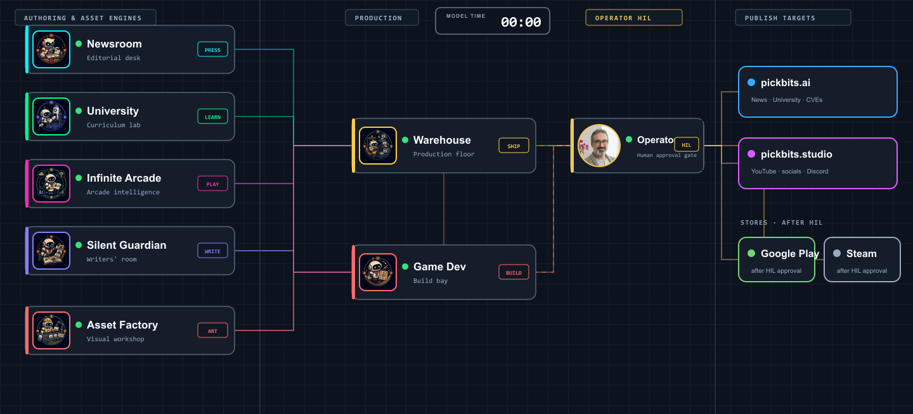

# Agentic systems that leave receipts

I’m the engineer and systems architect behind [PickBits](https://pickbits.ai/). I build local-first tools and creative systems where specialized agents exchange explicit contracts, produce inspectable artifacts, and stop for human judgment at the right boundary.

My work spans agent orchestration, developer tooling, evidence-backed content production, simulation games, and the infrastructure that connects them.

  

<em>A simplified operating map. The public products below are live; several engine repositories remain private while their reusable parts are prepared for release.</em>

## The PickBits universe

PickBits is a set of focused systems, not one giant agent:

- **Authoring engines** decide what is worth making: editorial research, curriculum, long-form narrative, game concepts, and asset briefs.
- **Production engines** turn approved contracts into articles, lessons, media, game assets, and releases.
- **Evidence gates** check sources, schemas, runtime behavior, and artifacts before work advances.
- **A human approval gate** retains authority over publishing, patching, and other consequential actions.

You can see the public side at [PickBits.AI](https://pickbits.ai/)—including [University](https://pickbits.ai/university/), [CyberHawk](https://pickbits.ai/cyberhawk/), and the [Arcade architecture](https://pickbits.ai/arcade)—and the creative work at [pickbits.studio](https://pickbits.studio/).

## Open source now

| Project | What it proves |
| --- | --- |
| [Session Index](https://github.com/MrPickering/session-index) | A private, localhost-only dashboard for finding, resuming, and following up on Codex and Claude Code sessions. No account, telemetry, or cloud database. |
| [PickBits Dependency Audit](https://github.com/pickbitsai/pickbits-dependency-audit) | Local dependency evidence, persistent finding history, zero-trust package admission, and remediation requests that cannot silently grant patch authority. |
| [enView](https://github.com/MrPickering/enView) | Cross-project `.env` inventory, exposure checks, and drift detection without printing secret values in audit output. |
| [SimCit](https://github.com/MrPickering/SimCit) | A browser city simulation built from the open Micropolis lineage, with a [live build](https://sim-cit.vercel.app/). |

These are small on purpose: runnable projects with a narrow job and explicit boundaries.

## What I’m extracting next

These are release candidates and working concepts from the private PickBits stack—not claims of public availability yet:

1. **Weaver — narrative state as a build graph.** A long-form writing pipeline where reader knowledge is derived state with provenance. Edit an earlier scene and every affected downstream state record becomes stale; releases are immutable.
2. **CodeSqueeze — context as a compiled artifact.** A repository compiler that extracts structure, signatures, framework signals, and task-specific context packs instead of dumping or blindly truncating files.
3. **Proof-carrying work items.** A portable contract for agentic work: stable identity, subject type, contract version, lifecycle, idempotency key, requested outputs, evidence, receipts, and human approval.
4. **Verifiable asset handoffs.** A manifest-driven protocol that takes an asset from request through generation and installation, then requires runtime and visual-QA receipts before calling it complete.

The common idea is simple: an agent saying “done” is not evidence. The artifact, contract, evaluator, and receipt should be inspectable by the next person or machine.

If one of these overlaps a problem you are solving, [open an issue](https://github.com/MrPickering/mrpickering/issues). I’d like the next releases to be useful outside PickBits from day one.

---

I work at the intersection of agent architecture, local-first software, evidence-first automation, and playful product design.
